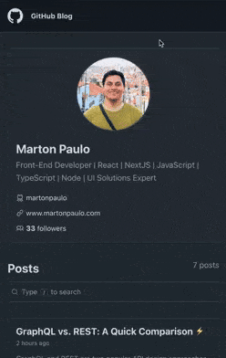

# 👨‍💻 GitHub Blog

    

 

🔗 **Live Project:** [martonpaulo.github.io/github-blog](https://martonpaulo.github.io/github-blog)

 

This project is based on a RocketSeat tutorial.

For more of my work, visit my portfolio: [martonpaulo.com](https://martonpaulo.com).

## 🔧 Features

1.

## 🛠️ Technologies Used

This project is built using React, Vite, TypeScript, Styled Components, React Router Dom, React Compiler, and GitHub Actions.

## 🚀 Getting Started

To get started with the project, follow these steps:

1. Clone the repository: `git clone https://github.com/martonpaulo/github-blog.git`
2. Navigate to the project directory: `cd github-blog`
3. Install the dependencies: `npm install`

## 📜 Available Scripts

In the project directory, you can run the following scripts:

- **`npm run dev`** - Starts the development server at `http://localhost:3000/github-blog`.
- **`npm run build`** - Builds the project for production, outputting the files to the `dist` folder.
- **`npm run lint`** - Runs ESLint to lint the code and ensure code quality.

## TODO List

- [x] Set up project with Vite, React, and TypeScript
- [x] Add License
- [x] Set up ESLint
- [x] Add project favicon
- [x] Change port to 3000
- [x] Initial setup by clearing unnecessary files
- [x] Add responsive layout
- [x] Set up GitHub repository
- [x] Add GitHub Actions and deploy to GitHub Pages
- [x] Create repository issues
- [x] Add Axios
- [x] [GitHub Users API](https://docs.github.com/pt/rest/users/users#get-a-user): `api.github.com/users/${login}`
- [x] [GitHub Issues API](https://docs.github.com/pt/rest/issues/issues#get-an-issue): `https://api.github.com/repos/rocketseat-education/reactjs-github-blog-challenge/issues/1`
- [x] [GitHub Search API](https://docs.github.com/pt/rest/search): `https://api.github.com/search/issues?q=Boas%20práticas%20repo:rocketseat-education/reactjs-github-blog-challenge`
- [x] Add React Hook Form and Zod
- [ ] Add package.json description and keywords
- [ ] Add README description
- [ ] Add GitHub description
- [ ] Add API information
- [ ] List project features
- [ ] List project technologies
- [ ] Add project recording
- [ ] Add project to portfolio

## 📄 License

This project is licensed under the **MIT License**. For more details, see the [LICENSE](LICENSE) file.
